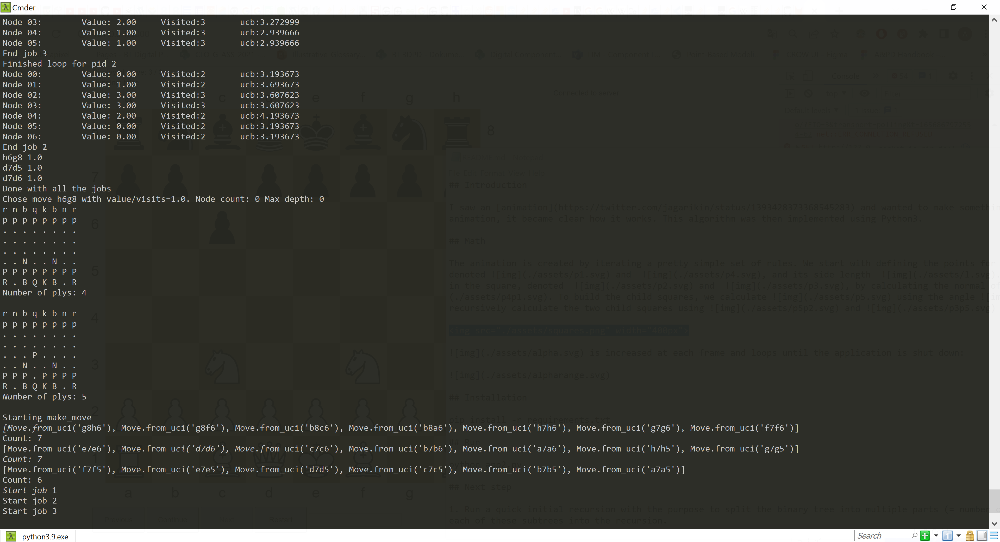
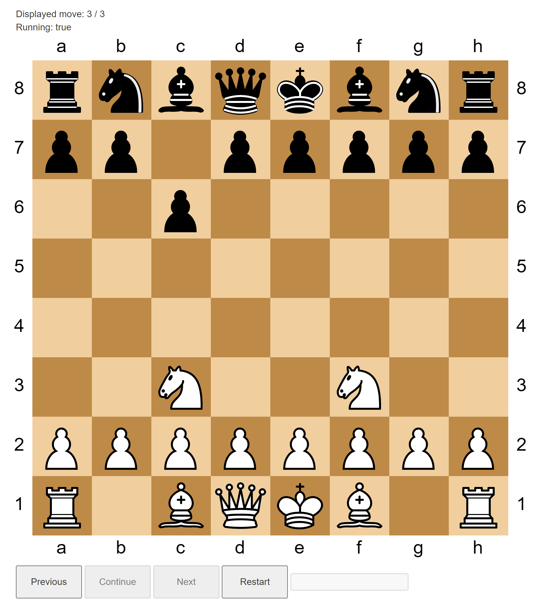

## Chess agents

Trying out some different algorithms for chess agents: [Minimax](https://en.wikipedia.org/wiki/Minimax) and [Monte Carlo tree search](https://www.chessprogramming.org/Monte-Carlo_Tree_Search)

Works with Python >= 3.7

Using [flask-socketio](https://flask-socketio.readthedocs.io/) for graphical play

## Running in console mode

The game can be run in console mode. This is mainly used for debugging, and for following the steps performed by the agents.

```
$ python runconsole.py
```



## Running in browser

The game can also be played in the browsed, either manually, by algorithms or a combination.

```
$ python game.py
```



## Human player

If you want to handle one (or both!) players manually, find the lines in the top of runconsole/game that inits a player and set the first parameter to True.

## Installation

```
$ pip install -r requirements.txt
```

## Todo

Add an agent based on deep neural networks. Download moves, add a fitness function and start training.

Chess moves  for download (PGN format)

https://www.kingbase-chess.net/